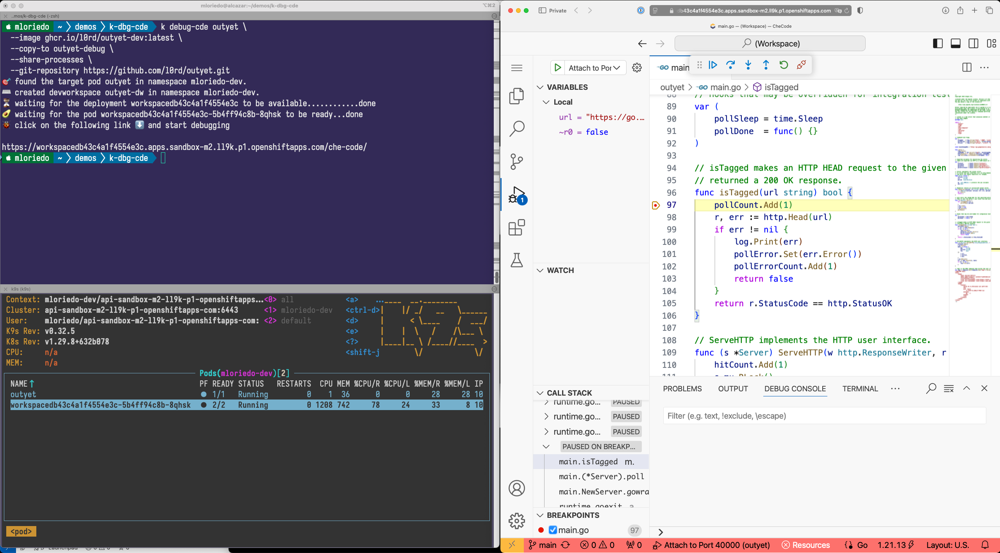

# kubectl-debug-cde

This repository implements a kubectl plugin to debug Pods with a Cloud Development Environment.



## Prerequirements

The [DevWorkspace Operator](https://github.com/devfile/devworkspace-operator/tree/main) needs to be installed in the Kubernetes cluster.

## Details

The plugin uses the [client-go library](https://github.com/kubernetes/client-go/tree/master/tools/clientcmd) to create a DevWorkspace in the current namespace.

It accepts the same flags as the command `kubectl debug` which it tries to mimic as much as possible, but including an IDE for source code debugging.

## Running

```sh
# assumes you have a working KUBECONFIG
$ go build cmd/kubectl-debug_cde.go
# place the built binary somewhere in your PATH
$ cp ./kubectl-debug_cde /usr/local/bin

# you can now begin using this plugin as a regular kubectl command:
# start debugging the pod `outyet`
$ kubectl debug-cde outyet \
  --image ghcr.io/l0rd/outyet-dev:latest \
  --copy-to outyet-debug \
  --share-processes \
  --git-repository https://github.com/l0rd/outyet.git
```

## Shell completion

This plugin supports shell completion when used through kubectl. To enable shell completion for the plugin
you must copy the file `./kubectl_complete-cde` somewhere on `$PATH` and give it executable permissions.

The `./kubectl_complete-cde` script shows a hybrid approach to providing completions:
1. it uses the builtin `__complete` command provided by [Cobra](https://github.com/spf13/cobra) for flags
1. it calls `kubectl` to obtain the list of pods to complete arguments (note that a more elegant approach would be to have the `kubectl-cde` program itself provide completion of arguments by implementing Cobra's `ValidArgsFunction` to fetch the list of pods, but it would then be a less varied example)

One can then do things like:
```
$ kubectl debug-cde <TAB>
outyet

$ kubectl debug-cde --<TAB>
--copy-to
--image
--git-repository
--share-processes
[...]
```

Note: kubectl v1.26 or higher is required for shell completion to work for plugins.

## Cleanup

You can "uninstall" this plugin from kubectl by simply removing it from your PATH:

    $ rm /usr/local/bin/kubectl-debug_cde
